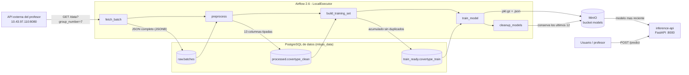

# Proyecto 1 — MLOps: orquestación, entrenamiento y servicio de modelos

**Curso:** Operaciones de Machine Learning (Nivel 1-2), Pontificia Universidad Javeriana
**Grupo:** 7
**Stack:** Docker Compose · Apache Airflow 2.6 · PostgreSQL 13 · MinIO (Silo) · FastAPI · scikit-learn

Este proyecto levanta, con un único `docker compose up`, un entorno de MLOps completo que recolecta datos de una API externa cada 5 minutos, los guarda en PostgreSQL en tres etapas (crudo, procesado y listo para entrenar), entrena un modelo de clasificación del tipo de cobertura forestal (dataset *Covertype*), publica cada modelo versionado en MinIO y lo sirve a través de una API de inferencia hecha con FastAPI.

El foco del proyecto no es el modelo en sí, sino **todo lo que hace falta para llevarlo a producción**: orquestación, trazabilidad de los datos, versionado y validación de artefactos, compatibilidad entre el entorno de entrenamiento y el de servicio, retención de modelos y tolerancia a fallos. Por eso este documento explica no solo *qué* se construyó, sino *por qué* se eligió cada pieza y qué alternativas se descartaron.

---

## Tabla de contenido

1. [Arquitectura](#1-arquitectura)
2. [Cómo fluye un dato: una ejecución del DAG de principio a fin](#2-cómo-fluye-un-dato-una-ejecución-del-dag-de-principio-a-fin)
3. [Estructura del repositorio](#3-estructura-del-repositorio)
4. [Cómo levantar el proyecto](#4-cómo-levantar-el-proyecto)
5. [Decisiones de diseño y alternativas consideradas](#5-decisiones-de-diseño-y-alternativas-consideradas)
6. [Resultados del modelo](#6-resultados-del-modelo)
7. [Problemas encontrados y cómo se resolvieron](#7-problemas-encontrados-y-cómo-se-resolvieron)
8. [Limitaciones conocidas y trabajo futuro](#8-limitaciones-conocidas-y-trabajo-futuro)
9. [Relación con los criterios de evaluación](#9-relación-con-los-criterios-de-evaluación)
10. [Documentación por componente](#10-documentación-por-componente)

---

## 1. Arquitectura



El sistema está compuesto por ocho servicios definidos en [`docker-compose.yaml`](docker-compose.yaml). Dos de ellos son contenedores de inicialización que se ejecutan una sola vez y terminan.

| Servicio | Imagen | Puerto expuesto | Rol |
|---|---|---|---|
| `postgres-airflow` | `postgres:13` | — | Base de metadatos **interna de Airflow** (estado de DAGs, ejecuciones, usuarios). |
| `postgres-data` | `postgres:13` | — | Base de **datos del negocio**, con los esquemas `raw`, `processed` y `train_ready`. |
| `minio` | `pgsty/silo` (fork de MinIO) | 9000 (API S3), 9001 (consola) | Almacenamiento de objetos para los modelos entrenados. |
| `minio-init` | `pgsty/mc` | — | Crea el bucket `models` al arrancar y termina. |
| `airflow-init` | imagen propia (`./airflow`) | — | Migra la base de metadatos de Airflow, crea el usuario administrador y termina. |
| `airflow-webserver` | imagen propia (`./airflow`) | 8080 | Interfaz web de Airflow. |
| `airflow-scheduler` | imagen propia (`./airflow`) | — | Programa el DAG y **ejecuta** sus tareas (con LocalExecutor, el scheduler también es el ejecutor). |
| `inference-api` | imagen propia (`./api`) | 8000 | API de inferencia: carga el último modelo desde MinIO y responde predicciones. |

Los servicios se comunican por la red interna que crea Docker Compose, usando el nombre del servicio como hostname (`postgres-data:5432`, `minio:9000`). Por eso las bases de datos no exponen puertos al exterior: solo Airflow las necesita y las alcanza por la red interna.

El orden de arranque está controlado con `depends_on` y condiciones explícitas. Los Postgres y MinIO tienen *healthchecks*, y los servicios que dependen de ellos esperan `service_healthy`. Airflow y la API esperan además a que su contenedor de inicialización termine con éxito (`service_completed_successfully`). Esto evita la clase de errores en que un servicio arranca antes de que su base de datos acepte conexiones.

---

## 2. Cómo fluye un dato: una ejecución del DAG de principio a fin

El DAG `pipeline_mlops_grupo7` ([`dags/pipeline_mlops.py`](dags/pipeline_mlops.py)) corre cada 5 minutos. Cada ejecución hace **una sola petición** a la API externa y completa el proceso entero, como exige el enunciado.

**1. `fetch_batch` — ingesta.** Hace `GET {EXTERNAL_API_BASE_URL}/data?group_number=7`. La API responde un JSON con la forma `{"group_number": 7, "batch_number": N, "data": [[...13 valores...], ...]}`: una porción aleatoria (5.810 filas en la práctica) del lote vigente. El lote cambia cada 5 minutos y hay 10 en total. La respuesta se guarda **completa y sin transformar** en `raw.batches` como `JSONB`, junto con la hora de captura. Esta tarea tiene `retries=0`: un reintento sería una segunda petición en la misma ejecución, lo que el enunciado prohíbe.

**2. `preprocess` — limpieza.** Toma el último registro de `raw.batches`, convierte `data` en un DataFrame con las 13 columnas del dataset y castea a número las 10 columnas cuantitativas y `Cover_Type` (la API manda **todo como texto**, incluso los números). Descarta las filas que no se pudieron convertir y agrega `source_raw_id` para saber de qué captura cruda salió cada fila. El resultado se **agrega** (`append`) a `processed.covertype_clean`.

**3. `build_training_set` — conjunto de entrenamiento.** Lee **todo** lo acumulado en `processed`, se queda con las 12 variables de entrada más el objetivo (deja fuera `source_raw_id`, que es trazabilidad y no una característica del terreno), elimina filas duplicadas y **reemplaza** `train_ready.covertype_train`. Esta tabla es una foto recalculable, no un historial.

**4. `train_model` — entrenamiento y publicación.** Si hay menos de 5.000 filas únicas o menos de 2 clases, la tarea se marca como *skipped* y no se publica nada. Si hay datos suficientes:
- Separa 80/20 para entrenamiento y prueba (`random_state=42`).
- Entrena un `Pipeline` de scikit-learn que incluye el `OneHotEncoder` para `Wilderness_Area` y `Soil_Type` y un `RandomForestClassifier` (50 árboles, profundidad máxima 20).
- Calcula accuracy y F1 macro.
- Serializa el pipeline con `pickle` (protocolo 4), **valida** que el artefacto no dependa de `dill` y lo comprime con gzip.
- Sube a MinIO primero `covertype_rf_<fecha UTC>.pkl.gz` y **al final** `covertype_rf_<fecha UTC>.json` con los metadatos. El `.json` funciona como señal de "modelo completo".

**5. `cleanup_models` — retención.** Lista los modelos del bucket y borra todos menos los 12 más recientes. Para cada modelo borra primero el `.json` y luego el archivo del modelo.

**6. La API** (fuera de Airflow): en cada `POST /predict` consulta cuál es el `.json` más reciente en MinIO. Si es distinto del modelo que tiene cargado, descarga el nuevo; si no, reutiliza el que tiene en memoria. Así, un modelo recién publicado empieza a servir predicciones en la siguiente petición, sin reiniciar la API.

Si cualquier tarea falla, las siguientes quedan como `upstream_failed` y **no se publica ningún modelo nuevo**. La API sigue sirviendo el último modelo válido. Este es el comportamiento buscado: un fallo en la recolección o el entrenamiento nunca deja a los usuarios sin servicio.

---

## 3. Estructura del repositorio

```
proyecto1/
├── README.md                  ← este documento
├── docker-compose.yaml        ← definición de los 8 servicios
├── .env                       ← variables de entorno (credenciales, grupo, URL externa)
├── airflow/                   ← imagen de Airflow con las librerías del pipeline
│   ├── Dockerfile
│   ├── requirements.txt
│   ├── constraints-3.7.txt    ← versiones oficiales de Airflow 2.6.0 para Python 3.7
│   └── README.md
├── dags/                      ← el pipeline (montado dentro de Airflow)
│   ├── pipeline_mlops.py
│   └── README.md
├── api/                       ← API de inferencia (FastAPI)
│   ├── Dockerfile
│   ├── pyproject.toml
│   ├── app/
│   │   ├── main.py            ← endpoints
│   │   ├── model_registry.py  ← carga del modelo desde MinIO
│   │   └── schemas.py         ← contrato de entrada/salida (Pydantic)
│   └── README.md
├── postgres-init/             ← script que crea esquemas y tablas al crear la base
│   ├── init-schemas.sql
│   └── README.md
├── minio/
│   └── README.md              ← MinIO no tiene código propio: se documenta aquí
├── dev/                       ← entorno local de desarrollo (no se despliega)
│   ├── pyproject.toml, uv.lock, constraints-2.6.0.txt
│   ├── check_dags.sh          ← valida que el DAG importa, igual que Airflow
│   ├── experimento_tamano_modelo.py
│   └── README.md
├── logs/                      ← logs de Airflow (montado, ignorado por git)
└── plugins/                   ← plugins de Airflow (vacío)
```

---

## 4. Cómo levantar el proyecto

### Requisitos

Hace falta Docker con el plugin Compose v2, unos 4 GB de RAM libres para los contenedores y acceso de red a `10.43.97.110:8080`, la API del profesor, que solo es accesible desde la red de la universidad o su VPN. Además, los puertos **8080, 8000, 9000 y 9001** deben estar libres en la máquina.

### Configuración

Todas las variables viven en [`.env`](.env). Docker Compose lo lee automáticamente y las inyecta en los servicios.

| Variable | Uso |
|---|---|
| `POSTGRES_DATA_USER`, `POSTGRES_DATA_PASSWORD`, `POSTGRES_DATA_DB` | Credenciales y nombre de la base de datos del negocio. |
| `MINIO_ROOT_USER`, `MINIO_ROOT_PASSWORD` | Credenciales de MinIO (también son las de la consola web). |
| `MINIO_BUCKET` | Bucket donde se publican los modelos (`models`). |
| `AIRFLOW_UID` | UID con el que corren los contenedores de Airflow (50000 por defecto). |
| `_AIRFLOW_WWW_USER_USERNAME`, `_AIRFLOW_WWW_USER_PASSWORD` | Usuario administrador de la interfaz de Airflow. |
| `AIRFLOW_WEBSERVER_SECRET_KEY` | Clave compartida entre webserver y scheduler (ver [5.12](#512-detalles-de-infraestructura-que-evitan-fallos-difíciles-de-diagnosticar)). |
| `EXTERNAL_API_BASE_URL` | URL de la API de datos del profesor. |
| `GRUPO_NUMERO` | Número de grupo asignado (7). |

### Arranque

```bash
cd proyecto1
docker compose up -d --build
docker compose ps -a
```

El primer arranque tarda varios minutos, porque construye las imágenes de Airflow y de la API. El estado correcto es: `minio-init` y `airflow-init` en **`Exited (0)`** (terminaron bien) y el resto en `Up` / `healthy`.

### Uso

| Qué | Dónde | Credenciales |
|---|---|---|
| Airflow | http://localhost:8080 | `airflow` / `airflow` |
| API de inferencia (Swagger) | http://localhost:8000/docs | — |
| Consola de MinIO | http://localhost:9001 | valores de `MINIO_ROOT_USER` / `MINIO_ROOT_PASSWORD` |

El DAG aparece **pausado** (`DAGS_ARE_PAUSED_AT_CREATION=true`). Hay que activarlo con el interruptor en la interfaz de Airflow; desde ese momento corre cada 5 minutos. También se puede lanzar a mano con *Trigger DAG*.

### Verificación rápida

```bash
# ¿Airflow llega a la API externa?
docker compose exec airflow-scheduler curl -s -m 10 "http://10.43.97.110:8080/data?group_number=7" | head -c 200

# Datos por etapa
docker compose exec postgres-data psql -U mlops -d mlops_data -c "
SELECT (SELECT COUNT(*) FROM raw.batches) AS raw,
       (SELECT COUNT(*) FROM processed.covertype_clean) AS processed,
       (SELECT COUNT(*) FROM train_ready.covertype_train) AS train_ready;"

# Modelos publicados
docker compose exec minio sh -c 'mc alias set yo http://localhost:9000 $MINIO_ROOT_USER $MINIO_ROOT_PASSWORD >/dev/null && mc ls yo/models'

# Modelo cargado en la API y una predicción
curl -s localhost:8000/health
curl -s -X POST localhost:8000/predict -H "Content-Type: application/json" -d '{
  "Elevation": 3142, "Aspect": 59, "Slope": 14,
  "Horizontal_Distance_To_Hydrology": 421, "Vertical_Distance_To_Hydrology": 61,
  "Horizontal_Distance_To_Roadways": 1471,
  "Hillshade_9am": 230, "Hillshade_Noon": 210, "Hillshade_3pm": 110,
  "Horizontal_Distance_To_Fire_Points": 3415,
  "Wilderness_Area": "Commanche", "Soil_Type": "C7757"}'
```

### Apagar

`docker compose down` detiene y borra los contenedores, pero **conserva los volúmenes**: datos, modelos y metadatos de Airflow. `docker compose down -v` borra también los volúmenes, y es necesario si se cambia `postgres-init/init-schemas.sql`, porque ese script solo corre cuando se crea la base.

---

## 5. Decisiones de diseño y alternativas consideradas

Cada subsección describe una decisión, las opciones evaluadas y la razón de la elección. Varias decisiones no se tomaron "a priori": surgieron al encontrar un problema real durante la construcción. Cuando es así, se indica.

### 5.1 Ejecutor de Airflow: LocalExecutor

| Opción | Ventajas | Desventajas |
|---|---|---|
| **LocalExecutor** (elegida) | Sin servicios extra. Las tareas corren como procesos del scheduler. Menos memoria y menos piezas que puedan fallar. | Paralelismo limitado a una máquina. |
| CeleryExecutor (usado en el taller 3) | Escala horizontalmente con varios *workers*. | Requiere Redis y contenedores `worker` y `triggerer`: más RAM y más complejidad en una VM compartida. |
| SequentialExecutor | El más simple. | Solo funciona con SQLite y ejecuta una tarea a la vez; no es apto fuera de pruebas. |

El DAG es lineal: cada tarea depende de la anterior, y además `max_active_runs=1` impide ejecuciones simultáneas. Nunca hay dos tareas que puedan correr en paralelo, así que Celery no aportaría nada y sí costaría recursos. La consecuencia práctica de LocalExecutor aparece en la sección 7: las tareas corren en procesos hijos del scheduler, y eso afecta al paralelismo de scikit-learn.

### 5.2 Dos instancias de PostgreSQL, y tres esquemas dentro de la de datos

**Separar metadatos de Airflow y datos de negocio.** La base interna de Airflow es de Airflow: la migra, la bloquea y la limpia a su manera. Mezclar ahí las tablas del proyecto acopla el ciclo de vida de los datos al del orquestador; por ejemplo, reinstalar Airflow no debería poner en riesgo los datos recolectados. Por eso hay dos contenedores: `postgres-airflow` y `postgres-data`.

**Etapas de datos como esquemas, no como bases ni contenedores separados.** El enunciado pide que PostgreSQL almacene información "sin procesar, procesada y lista para entrenamiento".

| Opción | Ventajas | Desventajas |
|---|---|---|
| **Una base, tres esquemas** (`raw`, `processed`, `train_ready`) (elegida) | Una sola conexión desde el DAG. Se puede hacer `JOIN` entre etapas. Separación lógica clara. Bajo consumo. | Las etapas comparten recursos y credenciales. |
| Tres bases de datos en el mismo servidor | Separación un poco más fuerte. | Tres conexiones distintas y sin consultas cruzadas. |
| Tres contenedores de Postgres | Aislamiento total. | Triplica memoria y operación para un volumen de datos pequeño. |

### 5.3 La etapa `raw` guarda la respuesta completa como JSONB

La alternativa era normalizar la respuesta en columnas desde el inicio. Se prefirió guardar el JSON exacto que devolvió la API por tres razones. **Reprocesabilidad:** si cambia la lógica de limpieza, se puede regenerar `processed` desde `raw` sin volver a pedir datos a la API, que además rota sus lotes. **Auditoría:** siempre se puede demostrar qué entregó la API y cuándo. **Robustez:** si la API cambia su formato, la ingesta no se rompe; el error aparece en `preprocess`, que es donde corresponde.

### 5.4 One-hot encoding dentro del modelo, no en el preprocesamiento

`Wilderness_Area` y `Soil_Type` llegan como texto (`"Commanche"`, `"C7757"`). En algún punto hay que convertirlas en columnas numéricas.

| Opción | Consecuencia |
|---|---|
| Codificar en `preprocess` y guardar las columnas binarias en Postgres | La API tendría que **repetir exactamente** la misma codificación. Cualquier diferencia entre ambas implementaciones produce predicciones erróneas sin ningún error visible (*training-serving skew*). |
| **`OneHotEncoder` dentro de un `Pipeline` de scikit-learn** (elegida) | La transformación viaja **dentro del mismo artefacto** que el modelo. La API recibe los valores crudos y el pipeline hace todo. Es imposible que entrenamiento y servicio se desincronicen. |

Además se usa `handle_unknown="ignore"`: si llega a `/predict` una categoría que el modelo nunca vio, se codifica como "ninguna categoría conocida" en vez de lanzar un error 500.

### 5.5 Entrenar con todo lo acumulado, sin duplicados

| Opción | Consecuencia |
|---|---|
| Entrenar solo con el último lote | Unas 5.800 filas, quizás sin todas las clases. Un modelo distinto, y peor, cada 5 minutos. |
| **Entrenar con todo lo acumulado** (elegida) | El modelo mejora a medida que llegan lotes, que es justamente lo que el proyecto busca mostrar. |

Acumular trae un efecto: la API entrega porciones aleatorias del **mismo** lote durante 5 minutos, y los 10 lotes se repiten en ciclo. Por eso llegan muchas filas repetidas; en una medición, 58.100 filas acumuladas se reducían a 37.939 únicas. `build_training_set` aplica `drop_duplicates()` y escribe con `if_exists="replace"`, porque `train_ready` es un derivado recalculable: con `append`, los datos se duplicarían en cada ejecución.

### 5.6 El modelo: Random Forest reducido, elegido con un experimento

Se eligió `RandomForestClassifier` porque no requiere escalar las variables numéricas (por eso el `ColumnTransformer` usa `remainder="passthrough"`), maneja bien relaciones no lineales y da buenos resultados sin ajuste fino. El foco del curso es el despliegue, no la optimización del modelo.

El primer modelo, con 100 árboles sin límite de profundidad, pesaba **41 MB**. Como se publica uno cada 5 minutos (288 al día), eso habría sido más de 11 GB diarios en la VM. En vez de reducirlo a ojo, se midió con [`dev/experimento_tamano_modelo.py`](dev/experimento_tamano_modelo.py), que usa los datos reales de `train_ready` (37.939 filas) y el mismo split que `train_model`:

| Configuración | Accuracy | MB | MB con gzip |
|---|---|---|---|
| 100 árboles, sin límite (original) | 0.9648 | 41.1 | 5.3 |
| 100 árboles, `max_depth=25` | 0.9663 | 40.3 | 5.3 |
| 100 árboles, `max_depth=20` | 0.9634 | 33.5 | 4.6 |
| 100 árboles, `max_depth=15` | 0.9489 | 18.4 | 2.8 |
| **50 árboles, `max_depth=20`** (elegida) | **0.9632** | **16.7** | **2.3** |
| 100 árboles, `min_samples_leaf=5` | 0.9532 | 21.3 | 3.5 |

Con `max_depth=25` el tamaño casi no cambia, porque los árboles ya llegaban a unos 25 niveles por sí solos. Bajar a profundidad 15 cuesta 1,6 puntos de accuracy. La configuración elegida pierde solo **0,16 puntos** y, combinada con gzip, reduce el artefacto **de 41 MB a 2,3 MB**, unas 18 veces menos.

### 5.7 Serialización: `pickle` protocolo 4 con gzip, validado antes de publicar

Esta decisión surgió de un fallo real, descrito en detalle en la sección 7. En resumen:

| Opción | Resultado |
|---|---|
| `joblib.dump` (la opción habitual) | ❌ Dentro de Airflow, el modelo quedaba con referencias a la librería `dill`, y la API no podía cargarlo (`ModuleNotFoundError: No module named 'dill'`). |
| `dill.extend(False)` y luego `joblib.dump` | ❌ No resolvía el problema, por el orden en que se importan `dill` y `joblib`. |
| **`pickle.dumps(model, protocol=4)` y luego `gzip.compress`** (elegida) | ✅ El serializador de `pickle` escrito en C no se ve afectado por `dill`. |

El **protocolo 4** es el más alto que soporta Python 3.7 (entrenamiento), y Python 3.10 (servicio) lo lee sin problema. La API sigue usando `joblib.load`, que detecta el formato gzip por sus primeros bytes y lee sin problema un pickle estándar.

Antes de publicar, `train_model` **valida el artefacto**: si el pickle, sin comprimir, contiene la cadena `dill`, la tarea falla y el modelo no se sube. Es una buena práctica general: detectar en el pipeline, donde el error es visible, un artefacto que fallaría en producción.

### 5.8 Versionado de modelos: fecha en el nombre y `.json` como señal de "completo"

Cada modelo se publica como un par de objetos con el mismo nombre base, `covertype_rf_AAAAMMDDTHHMMSS`: el artefacto `.pkl.gz` y sus metadatos `.json` (accuracy, F1 macro, filas usadas, clases, hiperparámetros, versión de scikit-learn, tamaño y formato de serialización).

Hay dos convenciones importantes. **Primero, el orden cronológico se toma del nombre, no de la fecha de modificación en MinIO.** La hora UTC en formato `AAAAMMDDTHHMMSS` hace que ordenar alfabéticamente sea lo mismo que ordenar por fecha, y el nombre no cambia si el objeto se copia o se vuelve a subir. **Segundo, el `.json` se sube al final y se borra primero.** La API solo considera un modelo cuando existe su `.json`, así que nunca intenta cargar un modelo cuyo archivo todavía se está subiendo, ni uno cuyo archivo ya se borró. Es el mismo principio que un *commit* en una base de datos.

### 5.9 Retención: conservar los últimos 12 modelos con una tarea del DAG

El enunciado exige que *"cada ejecución debe cumplir con el proceso completo"*, así que no es válido dejar de entrenar cuando los datos no cambian. Se publican unos 288 modelos al día y hace falta una política de retención.

| Opción | Evaluación |
|---|---|
| **Tarea `cleanup_models` que conserva los últimos N** (elegida, N = 12) | La regla es explícita en el código y visible en Airflow. **Borra por cantidad**: aunque el DAG deje de entrenar durante días, siempre quedan modelos. |
| Regla de expiración (ILM) de MinIO, por ejemplo "borrar objetos de más de 1 día" | Declarativa y sin código, pero **borra por antigüedad**: si el DAG se detiene más de un día, MinIO elimina *todos* los modelos y la API queda sin modelo al reiniciar. Esto casi ocurre durante el desarrollo, cuando se cayó la conexión a la API externa. Además, su granularidad mínima es de un día. |
| Publicar solo si el modelo nuevo es mejor (campeón/retador) | Atractivo, pero los accuracy de modelos distintos **no son comparables**: cada uno se evalúa con un conjunto de prueba distinto. Hacerlo bien requiere un conjunto de validación fijo; queda como trabajo futuro. |

N = 12 equivale a una hora de historial, un ciclo completo de los 10 lotes de la API. Con 2,3 MB por modelo son unos 28 MB en MinIO.

### 5.10 La API sirve el modelo más reciente, no el de mejor accuracy

El taller 2 elegía el modelo con mejor accuracy. Aquí eso sería engañoso, por la misma razón de la tabla anterior: los accuracy no se miden sobre los mismos datos. Además, como se entrena con datos acumulados, el modelo más reciente es el que vio más datos.

Para mantenerse al día, la API consulta el nombre del último `.json` en cada `/predict` (una llamada rápida de listado) y solo descarga el modelo si cambió. Hay además un `POST /reload` manual. Otras opciones consideradas fueron recargar solo al reiniciar la API, que obliga a reiniciarla en cada modelo nuevo, o consultar MinIO en segundo plano cada cierto tiempo, que es más eficiente pero agrega un hilo y su manejo de errores. Para este volumen de tráfico, la consulta por petición es la más simple y la más fácil de razonar.

Si no hay ningún modelo, la API **arranca igual** y `/predict` responde `503 Service Unavailable`. Nunca se cae por falta de modelo.

### 5.11 Compatibilidad de versiones entre entrenamiento y servicio

Un modelo serializado con pickle solo se puede cargar de forma confiable con **las mismas versiones de scikit-learn y numpy** con que se creó. El entrenamiento corre dentro de la imagen oficial `apache/airflow:2.6.0`, que usa **Python 3.7**, y ahí quedaron instaladas estas versiones (verificadas dentro del contenedor):

| Librería | Versión |
|---|---|
| scikit-learn | 1.0.2 |
| numpy | 1.21.6 |
| scipy | 1.7.3 |
| pandas | 1.3.5 |
| joblib | 1.3.2 |

Para la API se evaluó en qué versión de Python correrla:

| Python de la API | Resultado |
|---|---|
| 3.11 | ❌ numpy 1.21.6 no existe para Python 3.11. |
| 3.7 | ⚠️ Serviría, pero Python 3.7 ya no tiene soporte y FastAPI dejó de ser compatible con él. |
| **3.10** (elegida) | ✅ Las cinco librerías tienen paquetes precompilados (*wheels*) para 3.10, tanto en ARM (Mac) como en x86 (VM), y FastAPI actual funciona. |

Lo que importa para cargar el pickle es la versión de las **librerías**, no la de Python. Por eso en [`api/pyproject.toml`](api/pyproject.toml) esas cinco librerías van fijadas con `==`, no con `>=`: una actualización "inocente" de scikit-learn en la API podría romper la carga del modelo.

Del lado de Airflow, las librerías se instalan con el **archivo de constraints oficial** de Airflow 2.6.0 para Python 3.7. Ese archivo fija las versiones de todas las dependencias con las que Airflow fue probado. Se intentó exigir versiones modernas (`pandas>=2.2`), pero eran incompatibles con las que Airflow requiere, así que se aceptaron las versiones que fija el constraint.

### 5.12 Detalles de infraestructura que evitan fallos difíciles de diagnosticar

**Inicialización de Airflow con el patrón oficial.** `airflow-init` corre como root solo para dar permisos a las carpetas montadas, y delega la migración de la base y la creación del usuario al `/entrypoint` de la imagen (`_AIRFLOW_DB_UPGRADE=true`, `_AIRFLOW_WWW_USER_CREATE=true`). Además usa `set -e` y `exec`, para que cualquier fallo termine el contenedor con un código distinto de 0 y los servicios dependientes no arranquen.

**Misma `SECRET_KEY` en webserver y scheduler.** Si cada uno genera la suya, la interfaz responde 403 al intentar leer los logs de las tareas.

**`catchup=False` y `start_date` fijo.** Con `catchup=True`, Airflow crearía una ejecución por cada intervalo de 5 minutos desde el 1 de enero: más de 76.000 peticiones pendientes contra la API externa. El `start_date` es una fecha fija y nunca `datetime.now()`, porque el scheduler relee el archivo cada ~30 segundos y una fecha que se mueve impide que el DAG se programe.

**`max_active_runs=1`.** Si una ejecución tarda más de 5 minutos, la siguiente espera en vez de correr en paralelo. Así nunca hay dos peticiones simultáneas a la API ni dos escrituras concurrentes sobre `train_ready`.

**Datos insuficientes: *skipped*, no *failed*.** Con menos de 5.000 filas únicas (`MIN_TRAIN_ROWS`, más o menos un lote completo), `train_model` lanza `AirflowSkipException` y queda en rosado en la interfaz, no en rojo. En un sistema de monitoreo, el rojo debe significar "algo se rompió". Si también significa "aún no hay datos", la gente se acostumbra a ignorarlo. Como cada lote trae 5.810 filas, el umbral se supera desde la primera ejecución y el proceso completo se cumple siempre. El umbral protege contra un lote truncado o una base recién vaciada.

**Configuración que falla de inmediato si falta.** Las variables de entorno se leen con `os.environ["VAR"]`, no con `os.getenv("VAR", default)`. Si falta una variable, el DAG falla al importarse con un error claro, en vez de correr con un valor por defecto equivocado.

### 5.13 Imagen de MinIO: Silo

MinIO **eliminó sus imágenes `minio/minio` y `minio/mc` de Docker Hub el 11 de septiembre de 2026**, y poco después hizo privados sus repositorios en `quay.io`. Ambas rutas quedaron inutilizables durante el desarrollo de este proyecto.

| Opción | Evaluación |
|---|---|
| `minio/minio:latest` (Docker Hub) | ❌ `pull access denied`: el repositorio ya no existe. |
| `quay.io/minio/minio` | ❌ `401 UNAUTHORIZED`: repositorio privado. |
| Chainguard (`cgr.dev/chainguard/minio`) | ⚠️ Gratis solo con la etiqueta `:latest`, sin versión fija. |
| SeaweedFS, Garage | ⚠️ Compatibles con S3, pero no son MinIO, que es lo que pide el enunciado. |
| **`pgsty/silo`** (elegida), fork de MinIO mantenido por PGSTY | ✅ Es el mismo código de MinIO, con otro nombre por temas de marca. Mismo protocolo S3, mismas variables `MINIO_*`, consola completa. Etiqueta fija, arquitecturas `amd64` y `arm64`. |

Ni el DAG ni la API cambiaron: ambos usan el cliente `minio` de Python, que habla S3. La imagen se fija con una etiqueta de versión exacta y no con `:latest`: este episodio mostró que `:latest` significa no controlar qué versión se usa, o incluso si existe.

### 5.14 Entorno de desarrollo local con `uv`

Para probar el DAG sin levantar todo el stack, [`dev/`](dev/) tiene un entorno `uv` con `apache-airflow==2.6.0`. Python 3.7 no tiene versión para Mac con procesador Apple Silicon, así que el entorno local usa **Python 3.10**, dentro del rango soportado por Airflow 2.6. Las 643 versiones del archivo de constraints están declaradas en `[tool.uv].constraint-dependencies`, porque `uv add -c archivo` **no guarda** las constraints: cualquier `uv sync` posterior volvía a subir paquetes (por ejemplo `pendulum` 3.x) y rompía Airflow. El script `check_dags.sh` carga los DAGs con `DagBag`, igual que el scheduler.

Este entorno no replica exactamente al contenedor: pandas 1.5.3 en local frente a 1.3.5 en el contenedor. Por eso el **contenedor real es la fuente de verdad**. Un error de compatibilidad solo apareció en el contenedor; está descrito en la sección 7.

---

## 6. Resultados del modelo

Resultados medidos con 37.939 filas únicas: 30.351 para entrenamiento y 7.588 para prueba.

| Métrica | Valor |
|---|---|
| Accuracy de referencia (predecir siempre la clase más frecuente) | 0.624 |
| **Accuracy** | **0.963** |
| **F1 macro** | **0.910** |
| Tamaño del artefacto | 2,3 MB (gzip) |

**Distribución de clases** en los datos recolectados:

| `Cover_Type` | 0 | 1 | 2 | 3 | 4 | 5 | 6 |
|---|---|---|---|---|---|---|---|
| % de filas | 62,4 | 30,0 | 0,5 | — | 0,9 | 1,0 | 5,3 |

Hay tres observaciones importantes para interpretar estos números:
- **El accuracy por sí solo engaña con clases tan desbalanceadas.** Las clases 0 y 1 suman el 92% de los datos. Por eso se reporta también el **F1 macro**, que pesa igual a todas las clases. La diferencia de unos 5 puntos entre ambas métricas indica que al modelo le cuestan más las clases minoritarias.
- **La clase 3 no aparece** en los datos recolectados. El modelo no puede predecir una clase que nunca vio.
- **Las clases van de 0 a 6**, no de 1 a 7 como dice la descripción del dataset en el enunciado. Se detectó al revisar las respuestas reales de la API, un recordatorio de que conviene validar los datos reales y no solo la documentación.

---

## 7. Problemas encontrados y cómo se resolvieron

Esta sección documenta los errores reales que aparecieron durante la construcción. Varios son típicos de llevar un modelo a producción, y cada uno dejó una práctica concreta en el sistema.

**El modelo funcionaba en Airflow y fallaba en la API (`No module named 'dill'`).** Airflow importa la librería `dill` al arrancar, y `dill` modifica el pickle de Python puro para todo el proceso. `joblib`, al importarse *después*, copia esa tabla modificada para su propio serializador. Resultado: cada `joblib.dump` dentro de Airflow dejaba referencias a `dill` en el modelo. El primer intento, `dill.extend(False)`, no lo resolvió porque la copia de `joblib` ya estaba hecha. Se reprodujo el problema con el mismo orden de importación que en Airflow, y la solución fue serializar con el `pickle` escrito en C. **Práctica que quedó:** validar el artefacto antes de publicarlo. La validación detectó que el primer arreglo no funcionaba antes de que llegara a la API.

**`to_sql` fallaba solo dentro del contenedor.** El engine de SQLAlchemy se creaba con `future=True`, el modo "estilo 2.0". pandas 1.3.5 (contenedor) es anterior a ese modo y falla con `InvalidRequestError`; pandas 1.5.3 (entorno local) funciona. Se detectó probando ambas versiones antes de desplegar, y se quitó `future=True`. **Práctica que quedó:** el entorno local no es el de producción.

**`airflow-init` terminaba "con éxito" sin inicializar nada.** El script original ejecutaba `airflow db upgrade` directamente como root. En la imagen oficial, Airflow está instalado para el usuario `airflow`, y como root falla con `ModuleNotFoundError: No module named 'airflow'`. El script terminaba con `... || true` y sin `set -e`, así que salía con código 0. Scheduler y webserver arrancaban y entraban en un bucle de reinicios con "You need to initialize the database". **Práctica que quedó:** un paso de inicialización nunca debe ocultar sus errores.

**Las imágenes de MinIO desaparecieron.** Ver 5.13. **Práctica que quedó:** fijar versiones exactas de las imágenes.

**El entorno `uv` se rompía solo.** `uv add -c constraints.txt` aplica las constraints solo en ese comando. Un `uv run` posterior re-sincronizaba e instalaba `pendulum` 3.x, que Airflow 2.6 no soporta (`TypeError: 'module' object is not callable`). Se resolvió declarando las constraints en `pyproject.toml`.

**`fetch_batch` falló durante horas.** La API del profesor solo es accesible desde la red de la universidad. En desarrollo, con la VPN intermitente, 48 de 59 ejecuciones fallaron por conexión. El sistema se comportó como se diseñó: no se publicaron modelos y la API siguió sirviendo el último válido. En la VM, que está en la misma red, este problema no existe.

**`n_jobs=-1` no tenía efecto.** Con LocalExecutor, cada tarea corre en un proceso hijo del scheduler, y `joblib` (usado por scikit-learn para paralelizar) no puede crear procesos propios desde ahí. Se cambió a `n_jobs=1` para que el código refleje lo que realmente ocurre.

**Puertos ocupados al levantar el stack.** Otro Airflow local ocupaba el 8080 y un broker MQTT el 9001. Compose abortaba el arranque y dejaba la mayoría de contenedores en `Created`. Se resolvió deteniendo esos servicios y **sin modificar los puertos del compose**, para no introducir diferencias entre el entorno local y la VM.

---

## 8. Limitaciones conocidas y trabajo futuro

- **Credenciales en `.env` versionado.** Para un proyecto académico en una VM interna es aceptable, pero lo correcto es versionar solo un `.env.example` y mantener las credenciales reales fuera del repositorio, o usar un gestor de secretos.
- **MinIO (Silo) sin HTTPS y con usuario administrador.** Tanto el DAG como la API usan las credenciales raíz. Lo adecuado sería un usuario con permisos solo sobre el bucket `models`, de escritura para el DAG y de lectura para la API.
- **API sin autenticación**, y `joblib.load` deserializa pickle, que puede ejecutar código arbitrario: la API confía plenamente en el contenido del bucket. Es aceptable porque solo el DAG escribe en él.
- **Comparación entre modelos.** Cada modelo se evalúa sobre un conjunto de prueba distinto, por lo que sus métricas no son comparables entre sí. Un conjunto de validación fijo permitiría publicar solo modelos que mejoran (campeón/retador).
- **La API consulta MinIO en cada predicción.** Con mucho tráfico convendría un caché con tiempo de vida o una recarga en segundo plano.
- **`api/uv.lock` no se usa en el build.** El Dockerfile copia solo `pyproject.toml`. Copiar también el lock y usar `uv sync --frozen` haría el build totalmente reproducible.
- **CI/CD.** El despliegue se hace manualmente en la VM. El siguiente paso es un workflow de GitHub Actions nuevo, separado del `deploy.yml` de los talleres.


## 9. Relación con los criterios de evaluación

| Criterio del enunciado | Peso | Dónde se cumple |
|---|---|---|
| Código fuente en repositorio público | 10% | Este repositorio, carpeta `proyecto1/`. |
| Despliegue con Docker Compose en la VM, con interfaces expuestas | 10% | [`docker-compose.yaml`](docker-compose.yaml): Airflow :8080, MinIO :9001, API :8000. |
| Ejecuciones del DAG en Airflow | 30% | [`dags/pipeline_mlops.py`](dags/pipeline_mlops.py): una petición por ejecución, proceso completo en cada una. |
| Modelos almacenados en MinIO | 30% | Bucket `models`: pares `.pkl.gz` + `.json` versionados, con retención de 12. |
| Inferencia en la API | 20% | [`api/`](api/): `POST /predict` con el modelo más reciente desde MinIO. |

---

## 10. Documentación por componente

| Componente | README |
|---|---|
| Imagen de Airflow | [`airflow/README.md`](airflow/README.md) |
| DAG del pipeline | [`dags/README.md`](dags/README.md) |
| API de inferencia | [`api/README.md`](api/README.md) |
| PostgreSQL (esquemas y tablas) | [`postgres-init/README.md`](postgres-init/README.md) |
| MinIO | [`minio/README.md`](minio/README.md) |
| Entorno de desarrollo local | [`dev/README.md`](dev/README.md) |
